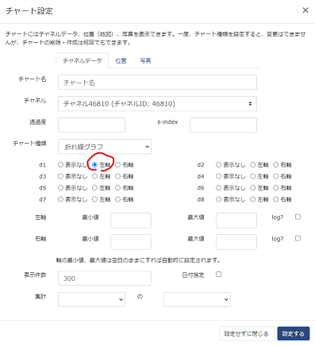
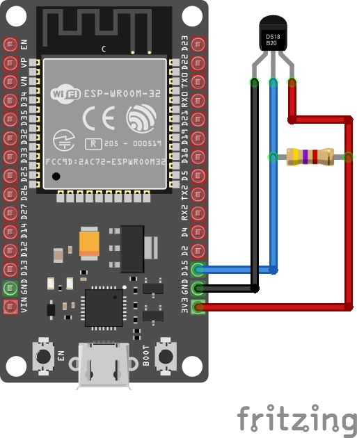

# IoT＋クラウド ハンズオン

## はじめに

* Arduino／マイコンとは
    * https://www.arduino.cc/en/Guide/Introduction
    * https://www.arduino.cc/en/Main/Products
    * シングルボードコンピューター「Raspberry Pi」との違い
* ESP32とは
    * https://ja.wikipedia.org/wiki/ESP32
    * https://docs.espressif.com/projects/arduino-esp32/en/latest/index.html
    * Arduinoとの違い
    * ESP8266（2014年～）とESP32（2016年～）
* 技適マークについて
* 今回使うマイコンボードに載っているもの
    * マイコンチップ「ESP32」
    * USBシリアル変換
    * 電圧レギュレータ（5V→3.3V）
* 開発環境
    * その１：Arduino IDE
    * その２：Visual Studio Code + PlatformIO

## Arduino開発環境準備

* 前提条件
    * Visual Studio Code がインストール済であること
* PlatformIO インストール
    * 拡張機能から「PlatformIO IDE」を検索してインストール
* 他の環境と分けるため、新規ワークスペースを作成
    * 「新しいウィンドウ」→「名前を付けてワークスペースを保存」
* 当リポジトリをclone
    * ワークスペース配下に「Projects」ディレクトリを作成、その下にcloneを推奨
* PlatformIOでプロジェクトを開く
* ビルドしてみる

## IoTデータの可視化サービス「Ambient」の準備

* 「Ambient」ユーザー登録
    * https://ambidata.io/
* 「チャネル」を作成
* 「ボード」にチャネルを追加
    * チャート設定は、1箇所さわるだけでOK



## 配線してPCとUSB接続



## マイコンボードへのプログラム書き込み

* platformio.iniの解説と編集
    * COMポート番号を編集
    * OneWire …温度センサーを接続する1-Wire通信規格のライブラリ
    * DallasTemperature …温度センサーのライブラリ
    * Ambient ESP32 ESP8266 lib …「Ambient」ライブラリ
* WiFiとAmbientの接続情報を書き換え
```
const char* ssid = "XXXXXXXX";
const char* password = "XXXXXXXX";
const unsigned int ambientChannelId = 99999u; // AmbientチャネルId
const char* ambientWriteKey = "XXXXXXXX"; // Ambientライトキー
```
* 書き込み（Upload）してみる
```
Connecting......
```
* マイコンボードの「BOOT」ボタンを押下して書き込みメッセージが終了するのを待つ
* 書き込み完了すると自動的に再起動されて動作開始

## ほかにはどんなことができるの？

* インプット
    * 様々なセンサーからの情報取得
    * 温度センサー
    * 照度センサー
    * CO2センサー
* アウトプット
    * WebAPIをたたいて連携
    * リレーによるスイッチ制御
    * 赤外線LEDによるリモコン制御
    * LEDやLCDなど、表示デバイスの制御
* 安価なホームオートメーションの構築
* AWSとも連携できる
    * https://aws.amazon.com/jp/builders-flash/202103/m5sticc-remote-control/
    * https://aws.amazon.com/jp/builders-flash/202101/iot-patlite/
    * https://aws.amazon.com/jp/builders-flash/202105/smart-pet-communication/
